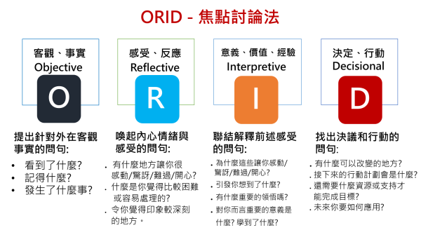

# The Focused Conversation Method - ORID (焦點討論法)

ORID，又稱焦點討論法 (Focused Conversation Method)，最早是由 ICA 發展推廣出來的。

是一種透過引導師展開結構性會談，ORID也是一種由`發散`到`收斂`的討論過程，成具體行動方案。  

---

## ORID 概念

* 概念圖
  
  > 引用 Ruddy Lee 老師的網站 (連結附在[參考](#參考))

* Objective : 客觀事實
* Reflective : 心情描述(感受)
* Iterpretive : 作法討論
* Decision : 執行方案
  <!-- * action item
  * action owner (提醒，確保作法有在落實) -->

---

## 參考

* [RPG retrospective workshop agile meetup_hsinchu](https://www.slideshare.net/secret/xAXXCBp4tHHG2r)
  * [pdf](./doc/rpgretrospectiveworkshopagilemeetuphsinchu3hrcompress-180528072729.pdf)

* [創新， 一件你不會相信的事 – Ruddy Lee 分享空間](https://ruddyblog.wordpress.com/2019/12/24/%e5%89%b5%e6%96%b0-%e4%b8%80%e4%bb%b6%e4%bd%a0%e4%b8%8d%e6%9c%83%e7%9b%b8%e4%bf%a1%e7%9a%84%e4%ba%8b/)

* [The Focused Conversation Method - ORID](https://www.slideshare.net/StephenBerkeley/the-focused-conversation-method-orid-63521262)

* [What Do Facilitators Do - YouTube](https://www.youtube.com/watch?v=UDLGjKBHSXg)
  

* [Focused Conversation ORID Method - Cynthia Lapp](./doc/Cynthia.Lapp__Focused_Conversation_ORID_Method.pdf)
