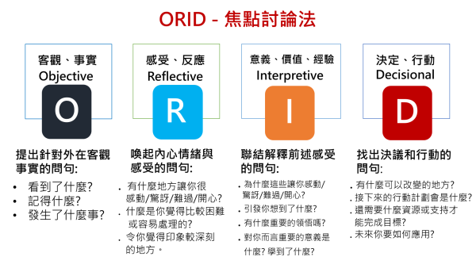
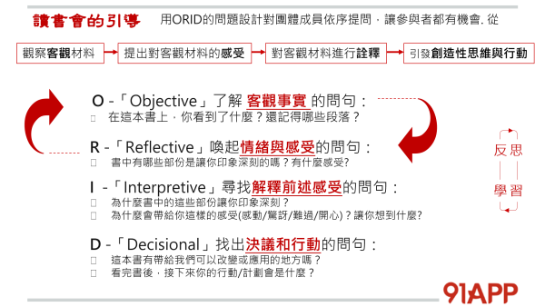

# The Focused Conversation Method - ORID (焦點討論法)

ORID，又稱焦點討論法 (Focused Conversation Method)，最早是由 ICA 發展推廣出來的。

是一種透過引導師展開結構性會談，ORID也是一種由`發散`到`收斂`的討論過程，成具體行動方案。  

 簡單易用的主要原因，將提問分成了四個層次的溝通方式，使其依照此順序，詢問對的問題，讓被討論的議題可以聚焦。

---

## ORID 概念

- 概念圖
  
  > 引用 Ruddy Lee 老師的網站 (連結附在[參考](#參考))

- O - [Objective]： 觀察外在客觀、事實。
  了解客觀事實問句如下：
  - 看到了什麼？
  - 記得什麼？
  - 發生了什麼事？
- R - [Reflective]：重視內在感受、反應。
  喚起情緒與感受的問句如下：
  - 有什麼地方讓你很感動/驚訝/難過/開心？
  - 什麼是你覺得比較困難/容易/處理的？
  - 令你覺得印象深刻的地方？
- I - [Iterpretive]：詮釋意義、價值、經驗。
  尋找前述意義與價值的問句如下：
  - 為什麼這些讓你很感動/驚訝/難過/開心？
  - 引發你想到了什麼？有什麼重要的領悟嗎？
  - 對你而言，重要的意義是什麼？學到了什麼？
- D - [Decision]：找出決定、行動。
  找出決議和行動的問句如下：
  - 有什麼我們可以改變的地方？
  - 接下來的行動/計劃會是什麼？
  - 還需要什麼資源或支持才能完成目標？

---

## ORID 範例

- 範例
  
  > 引用 Ruddy Lee 老師的網站 (連結附在[參考](#參考))

---

## 結語

ORID 適用情境蠻多的，以其精神發展出來的討論模式也不少，可以多方涉略，依照不同的目的及主題來挑選合適的方式討論。

> 如回顧會議可以採用時間軸方式討論，需要圖形想像可以用帆船理論

多方嘗試及刻意練習，會做到更好的效果。

### 自我提醒的反思及思考

小小的注意事項:

- 開場白
  執行過程，可以有個開場白，講解此次目的為何？會議前讓大家有所準備會更聚焦。
- 每個成員同等重要
  避免有意見領袖或刻意帶風向行為，成員需要互相尊重，以良善溝通為原則。
- 成員自主性
  引導人需注意是引導而非主導或誘導，讓團隊成員充分討論及做出共同決策(可能非全員同意，但大家可接受即可)。
  > 當然有時視情況，有時是需要團隊的成熟度，若跑得太遠適時的拉回來有時也是需要的。
- 決定項目
  不要貪多，盡可能濃縮到少數可控範圍(如:1~2項目)，好處是項目受限，則想要調整的樣目會是大家覺得最重要項目，且一次太多也很難確實落實。
- 事後的追蹤
  決定的事項需要後續追蹤，有個好的建議方式可以有 action owner 來負責追蹤項目是否落實。

---

## 參考

- [RPG retrospective workshop agile meetup_hsinchu](https://www.slideshare.net/secret/xAXXCBp4tHHG2r)
  - [pdf](./doc/rpgretrospectiveworkshopagilemeetuphsinchu3hrcompress-180528072729.pdf)

- [創新， 一件你不會相信的事 – Ruddy Lee 分享空間](https://medium.com/%E7%94%9F%E5%91%BD%E4%B8%AD%E7%9A%84543/%E7%94%9F%E5%91%BD%E4%B8%AD%E7%9A%84%E4%B8%80%E5%A0%82%E8%AA%B2-%E5%AD%B8%E5%95%8F-orid-c1c3aa6ec53a)

- [【生命中的一堂課】@學問 ORID. | by Vince Huang](https://medium.com/%E7%94%9F%E5%91%BD%E4%B8%AD%E7%9A%84543/%E7%94%9F%E5%91%BD%E4%B8%AD%E7%9A%84%E4%B8%80%E5%A0%82%E8%AA%B2-%E5%AD%B8%E5%95%8F-orid-c1c3aa6ec53a)

- [【文思不藏私】@刻意練習的好奇… | by Vince Huang](https://medium.com/%E6%96%87%E6%80%9D%E4%B8%8D%E8%97%8F%E7%A7%81/%E6%96%87%E6%80%9D%E4%B8%8D%E8%97%8F%E7%A7%81-%E5%88%BB%E6%84%8F%E7%B7%B4%E7%BF%92%E7%9A%84%E5%A5%BD%E5%A5%87-27956991e336)
  > 剛好看到有說明到薩提爾冰山模式 vs. ORID，蠻有共鳴的

- [問一個好問題，比得到答案本身還重要：善用「ORID」討論法為你的議題聚焦](https://www.cheers.com.tw/article/article.action?id=5087579)

- [The Focused Conversation Method - ORID](https://www.slideshare.net/StephenBerkeley/the-focused-conversation-method-orid-63521262)

- [What Do Facilitators Do - YouTube](https://www.youtube.com/watch?v=UDLGjKBHSXg)
  

- [Focused Conversation ORID Method - Cynthia Lapp](./doc/Cynthia.Lapp__Focused_Conversation_ORID_Method.pdf)

- [Book - 學問：100種提問力創造200倍企業力](https://www.books.com.tw/products/0010463047)
- [Book - The Art of Focused Conversation: 100 Ways to Access Group Wisdom in the Workplace](https://www.books.com.tw/products/F010511343?sloc=main)

- [ORID-discussion-method](doc/ORID-discussion-method.pdf)
