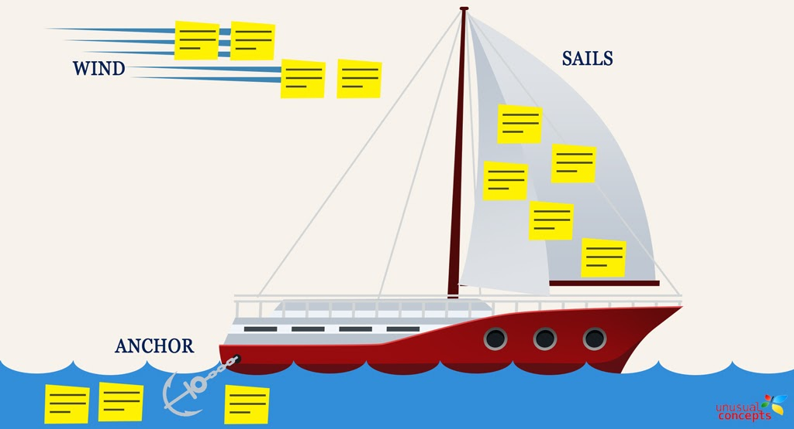
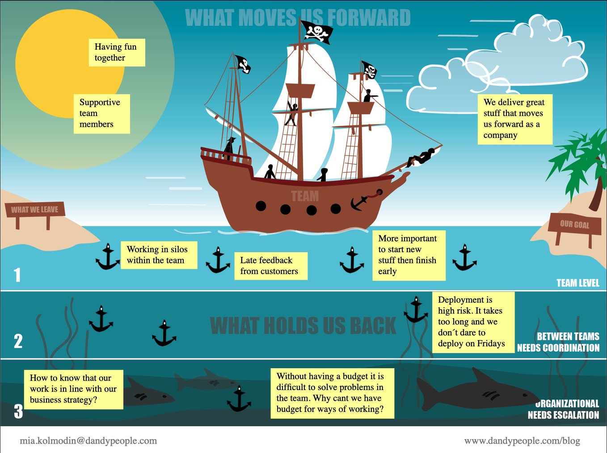

# Speed Boat Retrospective

回顧的一種方式應用，起源於 `Luke Hohmann` 的 [Innovation Games](https://www.innovationgames.com/)

---

## 大綱

- [Speed Boat Retrospective](#speed-boat-retrospective)
  - [大綱](#大綱)
  - [原始出處概要](#原始出處概要)
  - [其他的使用案例或變形的回顧方式](#其他的使用案例或變形的回顧方式)
    - [Enhancing Sprint Review With The Speed Boat Game](#enhancing-sprint-review-with-the-speed-boat-game)
    - [The Speedboat Retrospective – Free Download | Dandy People](#the-speedboat-retrospective--free-download--dandy-people)
  - [參考](#參考)
    - [Ref : Innovation Games 官方](#ref--innovation-games-官方)
    - [Ref : SPEED BOAT for Retro](#ref--speed-boat-for-retro)

---
---

## 原始出處概要

官方出處 :

- [Speed Boat - Innovation Games](https://www.innovationgames.com/speed-boat/)

**概要：**

初始內容是以產品為主，想像產品有如一艘快船 (speed boat)，駛向目的地，然而船遇到了一些錨 (anchor)，探討是什麼樣的錨阻礙了船的速度。

**目標：** 確定客戶對您的產品或服務不滿意的地方

**遊戲：**

- 繪製快艇
  - 期望快速移動
  - 有一些錨阻礙進行

- 想像
  - 船是您的系統
  - 錨點: 客戶不喜歡的功能

- 流程
  - 客戶在錨點上描述不喜歡的內容
  - 可估計走的多快 (在切開錨點後)
  > 速度的估計是痛苦的

- 隱喻
  - 可更改隱喻遊戲使其更符合需求 (更貼近業務)，以產生更有價值的回饋。

**為何有效 :**

盡管大多數客戶有投訴，但鮮少有客戶真正的`反對`您或您的產品。
即使他們出現及大的挫折，現實他們期望成功使用您的產品。
提供一個表達挫折的方法，而又不要讓一群人或一個人主導討論。
`Speed Boat` 提供這樣`安全`環境，使他們可以告訴您出了什麼問題。

許多人不願意用口頭表達挫折，讓他們有機會`寫`下一些東西，有助於`更安全`的過程。
對於有些不滿一的客戶而言，反思的機會及回重要。
要求他們用口頭表達他們的問題，尤其以書面形式，處使他們考慮這些問題。
在這過程會簡單的自我識別哪些為瑣碎問題，而可以更專注於重大的問題。
因此，他們最終開始表達自己的抱怨，將問題置入眼簾，使其習慣於思考自己的抱怨，尤其是量化的影響。

在某些產品，看似瑣碎的投訴數量，加總起來可以變成一個真正的大投訴。
在此過程 SpeedBoat 之所以起作用，是因為我們不將參與者限制在他們填佳到船的大小，形狀，重量或錨點的數量上。

**步驟 :**

  以下為引導者的開會流程及注意事項
  > 原文及細節可看 [MindSettlers | Facilitating the Speed Boat Game](https://www.mindsettlers.com/guide/5Z8ZVFE55SKA6oE4AYUcqe)

- step 1 : Understand what the Speed Boat game is for (了解 speed game 用途)

  講述 speed boat 遊戲概念...

- step 2 : Prepare for the game (準備遊戲)

  使用最佳圖像來讓心情愉悅。例如準備一些道具，貼紙等貼在白板，...

- step 3 : Keep the mood playful (保持心情愉快)

  這可以幫助每個人對反饋中潛在的壓力內容。

  使用可能的最佳圖像來保持愉悅心情。考慮在航海中訂製船，錨等圖片。

  或主題切換為飛機，摩托車，帆船...等。

- step 4 : Introduce the game: Tell a story using your nautical theme (介紹遊戲：使用航海主題講故事)

  介紹遊戲後，請給客戶幾分鐘時間收集他們的想法。

  然後期望他們創建錨點。

- step 5 : Start the process of posting anchors (開始發布錨點的過程)

  詢問客戶的關注點並將錨點放置在板上，同時填寫客戶的關注點並給錨點添加標題來演示遊戲玩法。

  然後，與客戶確認錨釘應放置的深度。邀請參與者加入填充板子過程並協助他們自己運作。

- step 6 : Invite customers to come to the board at anytime(邀請客戶隨時加入白板討論)

  沒有要求客戶輪流發布錨點。事實上如果有多個人同時發佈錨，則遊戲會更好地運行，原因為有一個審核過程。

  隨著遊戲的進行，您可以通過提出開放性強而有力的問題來啟動對話，以鼓勵客戶思考為什麼他們將物品放置在一定深度（嚴重程度）。
  
- step 7 : Allow the game to run its course (讓遊戲進行到底)

  很難預測一個小組會產生多少活動。 如果一開者活動進行緩慢，要有耐心。提出引導性問題，請某人先做榜樣(舉例子)。

- step 8 : As the game winds down, give warning of final minutes (當遊戲即將結束時，發出最後幾分鐘警告)

  參與者會很感激遊戲中剩餘幾分鐘時間的警告。

  如果您誤判了結束時間，收到一些匆忙和緊張行為的跡象，不要驚訝。

  而如果遊戲正在進行，允許更多時間也是可以的。

- step 9 : Review every anchor (審查每個錨點)

  讓你的客戶知道，他們的反饋很重要。

  審查每個錨點，並非意味要閱讀或分享每個錨點。

  有時，更好的方式是將類似的內容或主題的錨點快速分組，並作為一個小組討論這些錨。

  雖然只有一個客戶創建一個錨點，請全體客戶對所寫內容進行評論。

  當您審視(評論)錨點時，至關重要的是不要試圖解決問題，回應反饋，或證明為什麼做出某種選擇。這樣做會極大地改變遊戲動態。

  客戶不會鼓勵隊感知的問題進行直率和真誠的討論，而是會將你的回應理解為一種防禦機制，並很快地在溝通中變得戒備，對過程冷嘲熱諷。

  重點在於尋求瞭解這個錨點阻礙你們成功的根本原因，而不是在回應或現狀辯護。

  不要忘了感謝客戶，參與即是一種禮物。

- step 10 :[Variant] Which anchors chains should we cut first? ([變形] 我們應該先切斷哪個錨點?)

  考慮讓客戶投票選出前三名或前五名的錨，這些錨的拆除對船速的影響最大。

  讓他們對重要項目進行排名(依照位置)，或透過貼紙注釋。

- step 11 : [Variant] Ask customers to add “engines” to the boats ([變形] 要求客戶加上引擎)

  引擎代表可以`壓倒`錨的功能，使船的移動速度更快。

  這樣做要小心，因為這會改變遊戲的重點和動態。

  如果您真的認為您需要專注於添加功能。可以考慮 [Product Box](https://www.innovationgames.com/product-box/)

  購買或修改產品樹。

  然而，有時房間能量會發生變化，參與者自然而然地開始討論增加功能。

  當這種情況發生時，可順勢而為，水漲船高。

- step 12 : Process the results (處理結果)

  遊戲結束後，您和其他人可能希望對這些結果(產出物)做進行後處理。

  處理這些反饋的目標可根據三個關鍵屬性來分類

  - 與問題相關產品的特定(具體)區域

  - 問題的嚴重性

  - 修復的優先性或急迫性

  當您在處理卡片時，一定要把客戶寫的原始卡片的照片放進去，原因為卡片的空間排列既有意義，也有直接與客戶的反饋工作產生某種共鳴和親切感。

  甚至您可以透過客戶製作的卡片來感受客戶對某個主題的熱情。

  我見過有閃電，皺眉，`！#@&！#`、`grrrr` 等短語或用幾個感嘆號標點的語句的卡片。所有這些都反應出一個客戶對該主題非常關注。

---
---

## 其他的使用案例或變形的回顧方式

### Enhancing Sprint Review With The Speed Boat Game

- 來源 : [Enhancing Sprint Review With The Speed Boat Game | Scrum.org](https://www.scrum.org/resources/blog/enhancing-sprint-review-speed-boat-game)

- 概念圖

  

從網站提供的概念圖如上圖:

新增 Wind : 描述推進的動力，可解釋為什麼東西造成加速

內文有一些舉辦成功的技巧，可先參考。

---

### The Speedboat Retrospective – Free Download | Dandy People

- 來源 : [The Speedboat Retrospective – Free Download | Dandy People](https://dandypeople.com/blog/the-speedboat-retrospective-free-download-of-poster/)

- 概念圖

  

- 官方提供文件下載

  - [ppt 備份](./doc/retrospective-speedboat-pirate-ship-template-dandy-people.pptx)

- 面向:

|   圖騰  |         用途       |
|:-------:|:------------------:|
|   Goal  |  每個人的目標為何  |
|   Sun   |   覺得舒適的地方   |
|   Wind  | 哪些是增加速度的點 |
| Anchors |   哪些是拖慢的點   |
|  Shark  |      淺在風險      |

---
---

## 參考

### Ref : Innovation Games 官方

- [Innovation Games 官網](https://www.innovationgames.com/)

- [Innovation Games™ ppt](https://www.slideshare.net/emte69/innovation-games-14009295)

- [Speed Boat - Innovation Games](https://www.innovationgames.com/speed-boat/)

- [MindSettlers | Facilitating the Speed Boat Game](https://www.mindsettlers.com/guide/5Z8ZVFE55SKA6oE4AYUcqe)

- [Speed Boat Archives - Innovation Games](https://www.innovationgames.com/category/games/speed-boat/)

- [Product Box - Innovation Games](https://www.innovationgames.com/product-box/)

### Ref : SPEED BOAT for Retro

- [Improve Your Sprint Retrospectives – Speed Boat – David Manske on innovation, entrepreneurism, engineering, tips, tricks and ramblings](https://davidemanske.com/improve-your-sprint-retrospectives-speed-boat/)

- [The Speedboat Retrospective – Free Download | Dandy People](https://dandypeople.com/blog/the-speedboat-retrospective-free-download-of-poster/)

- [Enhancing Sprint Review With The Speed Boat Game | Scrum.org](https://www.scrum.org/resources/blog/enhancing-sprint-review-speed-boat-game)

- [【文思不藏私】Retro 小技巧 ～SPEED BOAT RETROSPECTIVE | by Vince Huang](https://medium.com/%E6%96%87%E6%80%9D%E4%B8%8D%E8%97%8F%E7%A7%81/%E6%96%87%E6%80%9D%E4%B8%8D%E8%97%8F%E7%A7%81-retro-%E5%B0%8F%E6%8A%80%E5%B7%A7-speed-boat-retrospective-5ea105d3590f)

- [Retrospective｜團隊如何尋找下一步行動的改善機會](https://medium.com/@4JolinTsai/%E5%B0%8B%E6%89%BE%E6%94%B9%E5%96%84%E4%B8%8B%E4%B8%80%E6%AD%A5%E8%A1%8C%E5%8B%95%E7%9A%84%E6%A9%9F%E6%9C%83-10c5b46a4d33)
